<div align="center">

# Jacquard

**parametric seamless pattern generator**

Eight generators, a palette you can edit down to the last digit, and a tile that matches on
every edge — made in the browser and downloaded as PNG or JPG for textile, tile and graphic design.

**[▶ Live demo — jacquard-aou.pages.dev](https://jacquard-aou.pages.dev)**

</div>

---

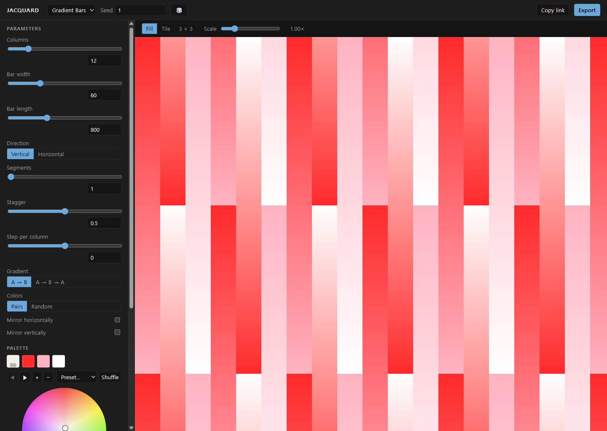

## What is Jacquard?

Jacquard is a single-page web app that builds **seamless repeat tiles**. Pick a generator from
the top bar, turn the sliders in the left panel, and the preview redraws on the spot. The palette
sits under the parameters: click a swatch, then set the colour on the wheel or type it as HEX,
RGB, HSL or HSB. When it looks right, Export writes a single tile at any scale, or a whole
canvas — 1080 × 1080, A3 at 300 dpi, or your own size up to 8192 px — as PNG or JPG.

Everything is reproducible. A generator is a pure function of its parameters, the palette and a
seeded PRNG, so the same seed always gives the same tile; the seed sits in the top bar with a dice
button next to it. The complete state — generator, seed, every parameter and every colour — is
base64url JSON in the URL hash, so **Copy link** hands someone else the exact pattern you are
looking at. And because the generator only ever emits a small intermediate scene of rectangles,
polygons and linear gradients, the tile you see on screen is the tile that gets exported.

## Screenshots

| Stripes — Poppy Field | Plaid — Underground |
| --- | --- |
| 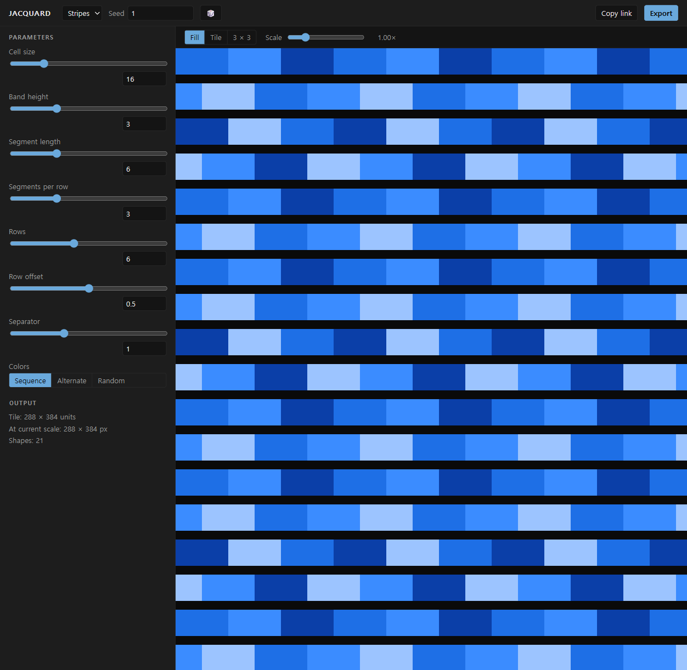 | 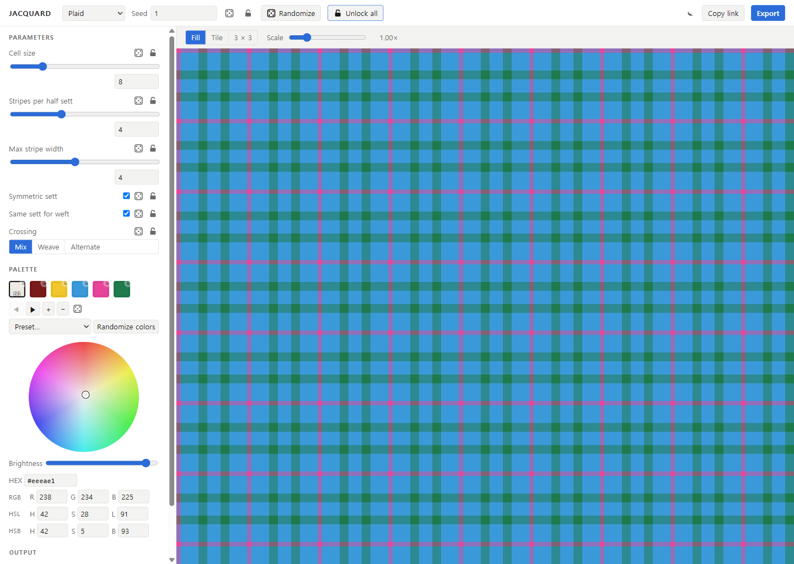 |

| Zigzag — Missoni Blue | Motif — Bauhaus |
| --- | --- |
| 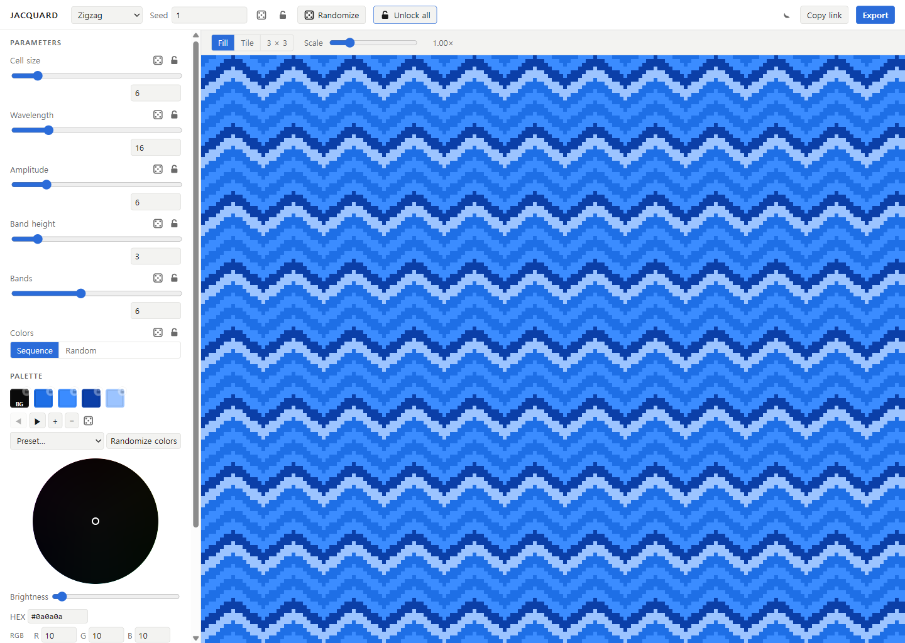 | 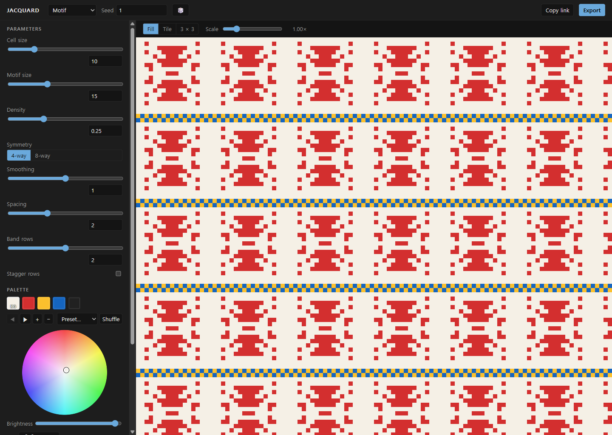 |

| Rings — Walala | Gradient Bars — Candy Weave |
| --- | --- |
| 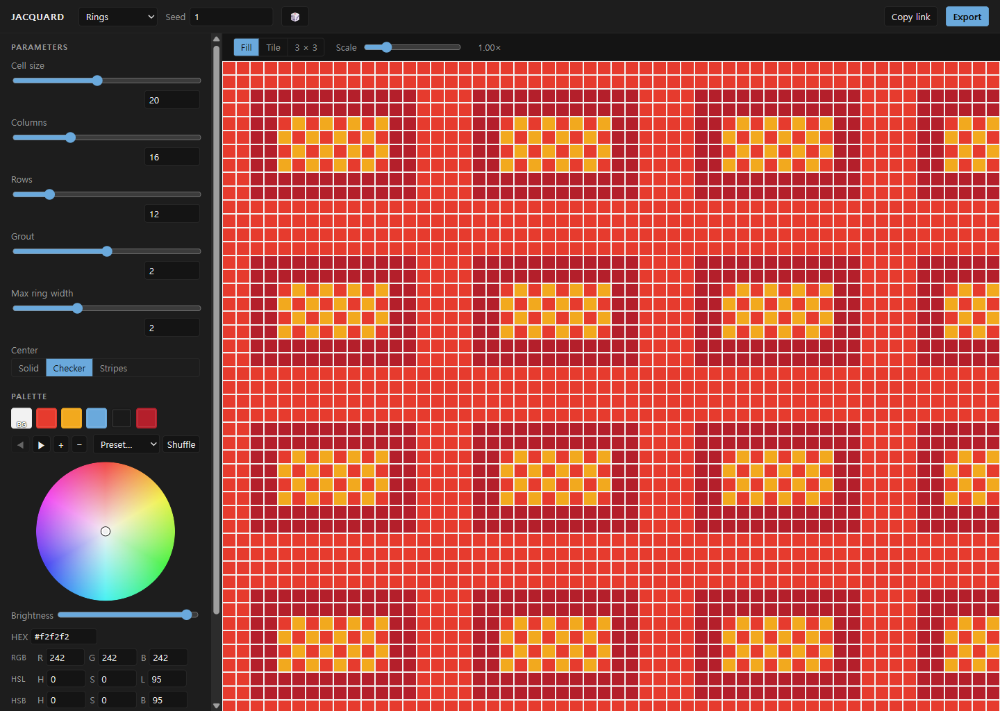 | 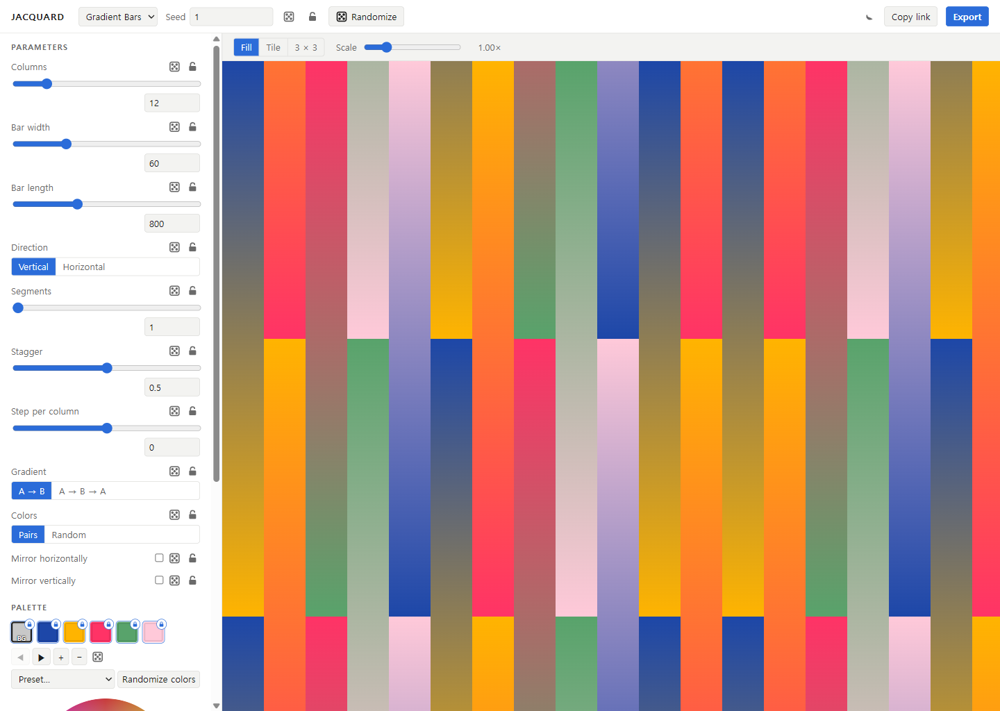 |

| Iso Cubes — Neon Op | Triangles — Neon Op, rhombus colouring |
| --- | --- |
| 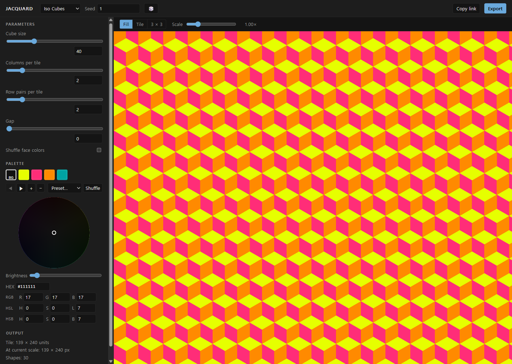 | 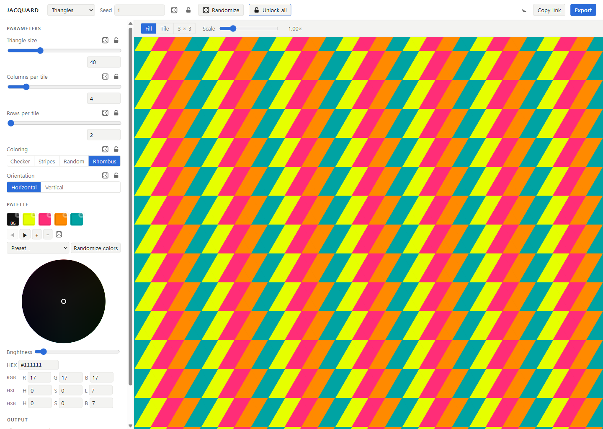 |

| Palette editor — wheel, brightness, HEX/RGB/HSL/HSB | Export dialog — canvas mode |
| --- | --- |
| 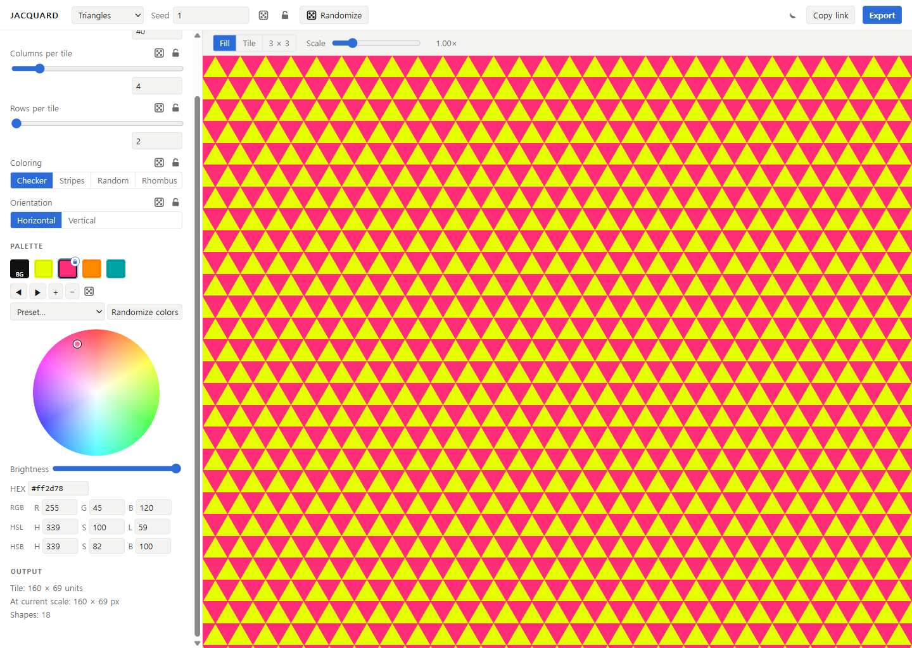 | 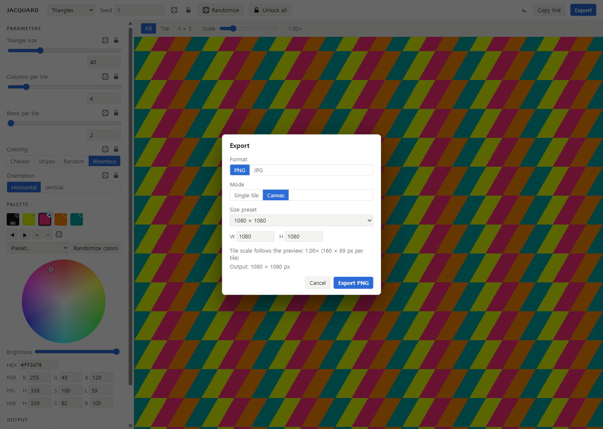 |

## Features

- **Eight generators in three families.** Grid: Stripes, Plaid, Zigzag, Motif, Rings.
  Gradient: Gradient Bars. Tessellation: Iso Cubes, Triangles. Each one carries its own
  parameter set, and switching generators resets the parameters while keeping your palette

| Family | Generator | What it makes | Parameters |
| --- | --- | --- | --- |
| grid | **Stripes** | Brick-laid bands split into colour segments, odd rows offset | Cell size 4–64, band height 1–8, segment length 2–16, segments per row 1–8, rows 2–12, row offset 0–1, separator 0–3, colours sequence / alternate / random |
| grid | **Plaid** | Tartan — a warp stripe sequence crossed with a weft one | Cell size 2–32, stripes per half sett 2–8, max stripe width 1–8, symmetric sett, same sett for weft, crossing mix / weave / alternate |
| grid | **Zigzag** | Chevron bands, stepped cell by cell | Cell size 2–32, wavelength 4–64, amplitude 0–32, band height 1–16, bands 2–12, colours sequence / random |
| grid | **Motif** | Fair Isle — a seeded symmetric motif repeated with stripe bands | Cell size 4–32, motif size 7–31 (odd), density 0.10–0.60, symmetry 4-way / 8-way, smoothing 0–2, spacing 0–6, band rows 0–4, stagger rows |
| grid | **Rings** | Concentric square tiles with grout showing the background through | Cell size 4–40, columns 6–40, rows 6–40, grout 0–4, max ring width 1–4, centre solid / checker / stripes |
| gradient | **Gradient Bars** | Columns of linear-gradient segments, staggered, stepped and mirrored | Columns 2–64, bar width 8–200, bar length 200–2000, direction, segments 1–12, stagger 0–1, step per column −1…1, gradient A→B or A→B→A, colours pairs / random, mirror horizontally / vertically |
| tessellation | **Iso Cubes** | Isometric cubes — three rhombi each — on a hex lattice | Cube size 10–120, columns per tile 1–8, row pairs per tile 1–8, gap 0–8, shuffle face colours |
| tessellation | **Triangles** | An equilateral triangle lattice filled by rule | Triangle size 10–120, columns per tile 2–16, rows per tile 2–16, colouring checker / stripes / random / rhombus, orientation horizontal / vertical |

- **Seed determinism** — every generator draws its random choices from a mulberry32 PRNG seeded
  by the number in the top bar (0 … 4294967295). Same generator, parameters, palette and seed →
  the same tile, every time, in the browser and in the test run
- **Palette editing** — up to 8 colours, with a floor set by the generator (3 for most, 4 for Iso
  Cubes). `palette[0]` is always the tile background and is tagged
  **BG**; the rest are foreground colours, cycled by every generator. Pick a swatch, then set it
  on the colour wheel (angle = hue, distance from centre = saturation), the brightness slider, or
  the HEX / RGB / HSL / HSB fields — all four stay in sync, and hue survives a trip through grey
- **Eight preset palettes** — Missoni Blue, Walala, Underground, Boogie, Poppy Field, Bauhaus,
  Neon Op, Candy Weave. **Shuffle** builds a new one instead: hues spaced by the golden angle
  (137.5°), saturation 55–85, value 35–90, and a background that is either very light or very dark
- **Three preview modes** — Fill repeats the tile across the whole canvas; Tile shows exactly one;
  3 × 3 shows nine with dashed boundary lines so you can check the seams. Scale runs 0.25× to 4×,
  and the panel reports the tile in units, in pixels at the current scale, and its shape count
- **PNG / JPG export** — *Single tile* renders one tile at a chosen px-per-unit scale;
  *Canvas* fills a fixed size by repeating the tile at the preview scale. Five size presets
  (1080 × 1080, 1920 × 1080, 1080 × 1920, A4 300 dpi 2480 × 3508, A3 300 dpi 3508 × 4961) plus a
  custom width and height. Anything over **8192 px** on a side is refused before a canvas is
  allocated. Files come out as `jacquard-<generator>-<seed>.png` / `.jpg`
- **URL sharing** — the whole state is base64url JSON in the location hash, rewritten 300 ms after
  your last change. **Copy link** puts the current URL on the clipboard; opening it restores the
  generator, seed, parameters and palette. A link with stale or hand-edited values still loads —
  unknown parameters are dropped, numbers are snapped and clamped, bad colours fall back

## Controls

The left panel is the instrument; the preview to the right is the result.

| Input | Result |
| --- | --- |
| Generator dropdown (top bar) | Switches generator. Parameters reset to that generator's defaults and the palette is kept, padded if the new generator needs more colours |
| Seed field, `Enter` or blur | Sets the seed (integer, 0 … 4294967295). Out-of-range or non-numeric input is ignored |
| 🎲 | Fresh random seed |
| Copy link | Copies the current URL to the clipboard; the button reads **Copied** for 1.2 s (or **Copy failed**) |
| Export | Opens the export dialog |
| Parameter sliders, number boxes, segmented buttons, checkboxes | Redraw the tile immediately |
| Palette swatch | Selects the colour to edit. The first swatch is tagged **BG** and is the tile background |
| ◀ ▶ | Move the selected colour along the palette |
| `+` / `−` | Add a colour (up to 8) / remove the selected one (down to the generator's minimum) |
| Preset… | Applies one of the eight preset palettes |
| Shuffle | Generates a new palette of the same length |
| Colour wheel, Brightness, HEX / RGB / HSL / HSB | Edit the selected colour |
| Fill / Tile / 3 × 3 | Preview mode |
| Scale slider | 0.25× to 4×, in quarter steps |

## How a tile is built

- **A generator is a pure function** — `generate({ params, palette, rng }) → Scene`. It never
  touches the DOM or a canvas, which is why all eight are tested in Node
- **Scene is the whole intermediate language** — a width, a height, a background colour and a flat
  list of shapes. A shape is a rectangle or a polygon, filled with a solid colour or a linear
  gradient. Nothing else exists in it
- **Seamless by construction** — a shape that crosses the tile edge goes through `tileWrap`, which
  translates a copy by ±tile size and clips it to the tile with Sutherland–Hodgman, so the piece
  that leaves the right edge comes back in on the left. Generators whose shapes already land
  inside the tile (Plaid, Zigzag, Rings) skip it and say why in a comment
- **One tile, then repeat** — the renderer draws the Scene once into an offscreen canvas at the
  requested pixel size, and `ctx.createPattern(tile, 'repeat')` fills the preview or the export
  canvas from it. Rectangle edges are rounded to whole device pixels and polygons get a 1 px
  stroke in their own fill colour, so anti-aliasing leaves no hairlines at the joins
- **`palette[0]` is the background** — every generator follows it, and foreground colours are
  cycled as `palette[1 + (i mod (len − 1))]`. That one convention is why any preset can be
  dropped onto any generator
- **The seed is the only randomness** — `mulberry32(seed)` supplies `next` / `int` / `pick` /
  `shuffle`, so nothing depends on `Math.random` once generation starts

## Tech stack

- [React 19](https://react.dev) + TypeScript 6 + [Vite 8](https://vite.dev)
- Canvas 2D for rendering and for PNG / JPG encoding (`toBlob`, JPEG quality 0.92) — no image
  libraries, no server round-trip
- [Vitest](https://vitest.dev) — 181 tests across 18 files, run in the Node environment because
  the generators, the Scene geometry and the colour maths never touch the DOM
- [oxlint](https://oxc.rs)
- Runtime dependencies: `react` and `react-dom`, and nothing else. The PRNG, the colour
  conversions and the colour wheel (two stacked CSS gradients) are all in this repo
- [Cloudflare Pages](https://pages.cloudflare.com), direct upload via `wrangler`

## Project structure

```
src/
├── App.tsx              # Pattern state, URL hash sync, panel + preview layout
├── main.tsx
├── styles.css
├── core/                # Pure logic, no DOM (all tested with Vitest)
│   ├── prng.ts          # mulberry32, randomSeed
│   ├── color.ts         # HEX / RGB / HSL / HSB conversion
│   ├── scene.ts         # Scene IR, tileWrap, polygon clipping
│   ├── params.ts        # Parameter definitions, snapping and clamping
│   ├── state.ts         # PatternState, base64url hash encode / decode
│   └── palettes.ts      # Presets, palette padding, golden-angle random palette
├── generators/          # One pure function per generator
│   ├── index.ts         # Registry + generateScene()
│   ├── types.ts         # GeneratorDef, GenContext
│   ├── util.ts
│   ├── stripes.ts  plaid.ts  zigzag.ts  motif.ts  rings.ts
│   └── gradientBars.ts  isoCubes.ts  triangles.ts
├── render/
│   ├── canvas.ts        # renderTile, renderFill (createPattern)
│   └── export.ts        # Size presets, 8192 px limit, encode, download
└── ui/
    ├── TopBar.tsx       # Generator, seed, copy link, Export
    ├── ControlPanel.tsx # Parameters + output readout
    ├── ParamControl.tsx # range / select / toggle widgets
    ├── PalettePanel.tsx # Swatches, presets, shuffle
    ├── ColorEditor.tsx ColorWheel.tsx ColorInputs.tsx colorMath.ts
    ├── Preview.tsx      # Fill / Tile / 3 × 3, scale
    └── ExportDialog.tsx
```

`App.tsx` owns the single `PatternState` (generator, seed, params, palette); the Scene is derived
from it with `useMemo`, and the view mode and preview scale are the only other pieces of state.

## Getting started

```bash
npm install
npm run dev        # http://localhost:5173
npm test           # Vitest — 181 tests, 18 files
npm run lint       # oxlint
npm run build      # production build → dist/
```

Deploy (Cloudflare Pages, direct upload):

```bash
npm run deploy     # build, then wrangler pages deploy dist --project-name=jacquard
```

## Known limitations

- **Raster export only.** PNG and JPG. The Scene IR is deliberately limited to rectangles,
  polygons and linear gradients so an SVG writer can be added on top of it, but that writer does
  not exist yet
- **No grain, blur or any other post-processing.** A tile is flat colour and linear gradients
- **No undo/redo.** Every edit applies at once, and the hash is rewritten in place with
  `history.replaceState`, so browser Back does not step through your changes either
- **Desktop layout only.** The app is laid out at a minimum width of 1024 px, with no mobile
  breakpoint and no touch gestures
- **A shared link is read once, at load.** Pasting a different hash into a tab that is already
  open does nothing until you reload — there is no `hashchange` listener
- **The Export dialog does not close with `Esc`.** Use Cancel, or click outside it
- **Very large tiles degrade rather than render.** If a tile exceeds what the browser will
  allocate as a canvas the preview shows *"Preview unavailable — tile too large for this
  browser"*, and export refuses any output over 8192 px on a side

## License

MIT — see [LICENSE](LICENSE).

---

# 한국어

## Jacquard란?

Jacquard는 **이어 붙여도 무늬가 맞는 반복 타일(seamless repeat)** 을 만드는 단일 페이지
웹앱입니다. 상단 바에서 생성기를 고르고 왼쪽 패널의 슬라이더를 움직이면 미리보기가 즉시
다시 그려집니다. 매개변수 아래가 팔레트입니다. 스와치를 클릭한 다음 색상환에서 색을 집거나
HEX·RGB·HSL·HSB로 직접 입력하면 됩니다. 마음에 들면 Export로 타일 한 장을 원하는 배율로
뽑거나, 캔버스 전체를 1080 × 1080, A4 300dpi, 또는 8192px까지 직접 지정한 크기로
PNG·JPG로 내려받습니다.

모든 결과는 재현됩니다. 생성기는 매개변수·팔레트·시드 PRNG만 입력으로 받는 순수 함수라
같은 시드는 언제나 같은 타일을 냅니다. 시드는 상단 바에 있고 옆의 주사위 버튼으로 바꿉니다.
생성기, 시드, 모든 매개변수와 모든 색을 담은 상태 전체가 URL 해시에 base64url JSON으로
들어가므로 **Copy link** 한 번이면 지금 보고 있는 패턴을 그대로 넘길 수 있습니다. 또한
생성기는 사각형·다각형·선형 그라데이션만으로 이루어진 작은 중간 표현(Scene)만 내놓기
때문에, 화면에서 본 타일이 그대로 내보내집니다.

## 스크린샷

| Stripes — Poppy Field | Plaid — Underground |
| --- | --- |
|  |  |

| Zigzag — Missoni Blue | Motif — Bauhaus |
| --- | --- |
|  |  |

| Rings — Walala | Gradient Bars — Candy Weave |
| --- | --- |
|  |  |

| Iso Cubes — Neon Op | Triangles — Neon Op, Rhombus |
| --- | --- |
|  |  |

| 팔레트 편집기 — 색상환, 명도, HEX/RGB/HSL/HSB | 내보내기 대화상자 — 캔버스 모드 |
| --- | --- |
|  |  |

## 주요 기능

- **세 계열, 생성기 8종.** 격자·직조: Stripes, Plaid, Zigzag, Motif, Rings. 그라데이션:
  Gradient Bars. 기하 테셀레이션: Iso Cubes, Triangles. 각 생성기는 자기 매개변수 세트를
  가지며, 생성기를 바꾸면 매개변수는 기본값으로 돌아가고 팔레트는 유지됩니다

| 계열 | 생성기 | 만드는 무늬 | 매개변수 |
| --- | --- | --- | --- |
| 격자 | **Stripes** | 색 세그먼트로 나뉜 띠를 벽돌처럼 어긋나게 쌓은 무늬 | 셀 4–64, 띠 높이 1–8, 세그먼트 길이 2–16, 행당 세그먼트 1–8, 띠 수 2–12, 행 오프셋 0–1, 구분선 0–3, 색 배정 sequence / alternate / random |
| 격자 | **Plaid** | 타탄 — 세로 줄(warp)과 가로 줄(weft) 시퀀스를 교차 | 셀 2–32, 반 세트 줄 수 2–8, 줄 폭 상한 1–8, 대칭 세트, weft에 같은 세트, 교차 규칙 mix / weave / alternate |
| 격자 | **Zigzag** | 셀 단위로 계단지는 셰브런 띠 | 셀 2–32, 파장 4–64, 진폭 0–32, 띠 두께 1–16, 띠 수 2–12, 색 배정 sequence / random |
| 격자 | **Motif** | 페어아일 — 시드로 만든 대칭 모티프와 줄무늬 띠 | 셀 4–32, 모티프 크기 7–31(홀수), 밀도 0.10–0.60, 대칭 4-way / 8-way, 스무딩 0–2, 간격 0–6, 띠 행 0–4, 행 엇갈림 |
| 격자 | **Rings** | 배경이 줄눈으로 비치는 동심 사각 타일 | 셀 4–40, 열 6–40, 행 6–40, 줄눈 0–4, 링 두께 상한 1–4, 중심 solid / checker / stripes |
| 그라데이션 | **Gradient Bars** | 어긋남·계단·미러가 들어간 선형 그라데이션 막대 | 열 2–64, 막대 폭 8–200, 막대 길이 200–2000, 방향, 분할 1–12, 어긋남 0–1, 열당 계단 −1…1, 그라데이션 A→B / A→B→A, 색 배정 pairs / random, 좌우·상하 미러 |
| 테셀레이션 | **Iso Cubes** | 육각 격자 위에 마름모 세 개로 세운 등각 큐브 | 큐브 크기 10–120, 타일당 열 1–8, 타일당 행 쌍 1–8, 간격 0–8, 면 색 섞기 |
| 테셀레이션 | **Triangles** | 규칙으로 채운 정삼각형 격자 | 삼각형 크기 10–120, 타일당 열 2–16, 타일당 행 2–16, 채색 checker / stripes / random / rhombus, 방향 horizontal / vertical |

- **시드 결정성** — 모든 생성기는 상단 바의 숫자(0 … 4294967295)로 시드된 mulberry32 PRNG에서만
  무작위를 끌어옵니다. 생성기·매개변수·팔레트·시드가 같으면 브라우저에서도 테스트에서도
  언제나 같은 타일이 나옵니다
- **팔레트 편집** — 최대 8색이고, 하한은 생성기가 정합니다(대부분 3색, Iso Cubes는 4색).
  `palette[0]`은 언제나 타일 배경이고 **BG** 표시가 붙습니다.
  나머지는 전경색으로 모든 생성기가 돌려 씁니다. 스와치를 고른 뒤 색상환(각도 = 색상, 중심에서의
  거리 = 채도), 명도 슬라이더, HEX / RGB / HSL / HSB 입력 중 아무거나 쓰면 되고, 네 입력은 서로
  동기화되며 회색을 거쳐도 색상(H)이 유지됩니다
- **프리셋 팔레트 8종** — Missoni Blue, Walala, Underground, Boogie, Poppy Field, Bauhaus,
  Neon Op, Candy Weave. **Shuffle**은 대신 새 팔레트를 만듭니다. 색상은 황금각(137.5°) 간격,
  채도 55–85, 명도 35–90, 배경은 아주 밝거나 아주 어둡게
- **미리보기 3모드** — Fill은 캔버스 전체를 타일로 채우고, Tile은 한 장만, 3 × 3은 아홉 장을
  파선 경계와 함께 보여 줘 이음새를 확인할 수 있습니다. 배율은 0.25×–4×이고, 패널은 타일의
  unit 크기, 현재 배율의 px 크기, 도형 개수를 알려 줍니다
- **PNG / JPG 내보내기** — *Single tile*은 타일 한 장을 지정한 unit당 px 배율로 렌더하고,
  *Canvas*는 미리보기 배율의 타일을 반복해 정해진 크기를 채웁니다. 크기 프리셋 5종
  (1080 × 1080, 1920 × 1080, 1080 × 1920, A4 300dpi 2480 × 3508, A3 300dpi 3508 × 4961)과
  직접 입력을 지원하고, 한 변이 **8192px**을 넘으면 캔버스를 만들기 전에 막습니다. 파일명은
  `jacquard-<생성기>-<시드>.png` / `.jpg`입니다
- **URL 공유** — 상태 전체가 URL 해시에 base64url JSON으로 들어가며, 마지막 변경 300ms 뒤에
  갱신됩니다. **Copy link**로 현재 주소를 복사하고, 그 주소를 열면 생성기·시드·매개변수·팔레트가
  복원됩니다. 낡거나 손으로 고친 링크도 열립니다. 모르는 매개변수는 버리고, 숫자는 step에 맞춰
  스냅·클램프하며, 잘못된 색은 기본값으로 되돌립니다

## 조작 방법

왼쪽 패널이 악기이고, 오른쪽 미리보기가 그 결과입니다.

| 조작 | 동작 |
| --- | --- |
| 생성기 드롭다운(상단 바) | 생성기 전환. 매개변수는 그 생성기의 기본값으로 돌아가고, 팔레트는 유지됩니다(색이 모자라면 채워 넣습니다) |
| 시드 입력 후 `Enter` 또는 포커스 해제 | 시드 지정(정수 0 … 4294967295). 범위 밖이거나 숫자가 아니면 무시합니다 |
| 🎲 | 새 무작위 시드 |
| Copy link | 현재 주소를 클립보드로 복사. 버튼이 1.2초 동안 **Copied**(실패 시 **Copy failed**)로 바뀝니다 |
| Export | 내보내기 대화상자를 엽니다 |
| 매개변수 슬라이더·숫자 입력·분절 버튼·체크박스 | 타일을 즉시 다시 그립니다 |
| 팔레트 스와치 | 편집할 색 선택. 첫 스와치는 **BG** 표시가 붙은 타일 배경입니다 |
| ◀ ▶ | 선택한 색을 팔레트 안에서 이동 |
| `+` / `−` | 색 추가(최대 8) / 선택한 색 삭제(생성기 최소 색 수까지) |
| Preset… | 프리셋 팔레트 8종 중 하나를 적용 |
| Shuffle | 같은 길이의 팔레트를 새로 생성 |
| 색상환, Brightness, HEX / RGB / HSL / HSB | 선택한 색을 편집 |
| Fill / Tile / 3 × 3 | 미리보기 모드 |
| 배율 슬라이더 | 0.25×–4×, 0.25 단위 |

## 타일이 만들어지는 방식

- **생성기는 순수 함수다** — `generate({ params, palette, rng }) → Scene`. DOM도 Canvas도 건드리지
  않기 때문에 8종 전부를 Node에서 테스트합니다
- **Scene이 중간 언어의 전부다** — 폭, 높이, 배경색, 그리고 도형의 평평한 목록. 도형은 사각형이나
  다각형이고, 채움은 단색 또는 선형 그라데이션입니다. 그 밖에는 아무것도 없습니다
- **구조적으로 이음새가 없다** — 타일 경계를 넘는 도형은 `tileWrap`을 거칩니다. 타일 크기만큼
  ±이동한 복사본을 만들어 Sutherland–Hodgman으로 타일에 잘라 붙이므로, 오른쪽으로 나간 조각이
  왼쪽으로 들어옵니다. 도형이 이미 타일 안에만 놓이는 생성기(Plaid, Zigzag, Rings)는 건너뛰고 그
  이유를 주석에 남깁니다
- **타일 한 장을 그리고 반복한다** — 렌더러는 Scene을 오프스크린 캔버스에 원하는 픽셀 크기로 한 번
  그린 뒤 `ctx.createPattern(tile, 'repeat')`으로 미리보기나 내보내기 캔버스를 채웁니다. 사각형
  변은 장치 픽셀에 맞춰 반올림하고 다각형에는 같은 색으로 1px 스트로크를 덧그려, 안티에일리어싱
  때문에 이음매에 실선이 뜨지 않게 합니다
- **`palette[0]`은 배경이다** — 모든 생성기가 이 규약을 따르고, 전경색은
  `palette[1 + (i mod (len − 1))]`로 순환합니다. 이 한 가지 규약 덕분에 어떤 프리셋도 어떤 생성기에
  그대로 얹을 수 있습니다
- **무작위는 시드뿐이다** — `mulberry32(seed)`가 `next` / `int` / `pick` / `shuffle`을 제공하므로,
  생성이 시작된 뒤에는 `Math.random`에 기대는 곳이 없습니다

## 기술 스택

- [React 19](https://react.dev) + TypeScript 6 + [Vite 8](https://vite.dev)
- 렌더와 PNG / JPG 인코딩 모두 Canvas 2D (`toBlob`, JPEG 품질 0.92). 이미지 라이브러리도, 서버
  왕복도 없습니다
- [Vitest](https://vitest.dev) — 18개 파일 181개 테스트. 생성기·Scene 기하·색 변환이 DOM과 무관해
  Node 환경에서 그대로 돌립니다
- [oxlint](https://oxc.rs)
- 런타임 의존성은 `react`와 `react-dom` 둘뿐입니다. PRNG, 색 변환, 색상환(CSS 그라데이션 두 겹)은
  모두 이 저장소 안에 있습니다
- [Cloudflare Pages](https://pages.cloudflare.com), `wrangler` 직접 업로드

## 폴더 구조

```
src/
├── App.tsx              # 패턴 상태, URL 해시 동기화, 패널 + 미리보기 배치
├── main.tsx
├── styles.css
├── core/                # DOM과 무관한 순수 로직 (전부 Vitest로 검증)
│   ├── prng.ts          # mulberry32, randomSeed
│   ├── color.ts         # HEX / RGB / HSL / HSB 변환
│   ├── scene.ts         # Scene IR, tileWrap, 다각형 클리핑
│   ├── params.ts        # 매개변수 정의, 스냅과 클램프
│   ├── state.ts         # PatternState, base64url 해시 인코딩/디코딩
│   └── palettes.ts      # 프리셋, 팔레트 채우기, 황금각 무작위 팔레트
├── generators/          # 생성기 하나당 순수 함수 하나
│   ├── index.ts         # 레지스트리 + generateScene()
│   ├── types.ts         # GeneratorDef, GenContext
│   ├── util.ts
│   ├── stripes.ts  plaid.ts  zigzag.ts  motif.ts  rings.ts
│   └── gradientBars.ts  isoCubes.ts  triangles.ts
├── render/
│   ├── canvas.ts        # renderTile, renderFill (createPattern)
│   └── export.ts        # 크기 프리셋, 8192px 상한, 인코딩, 내려받기
└── ui/
    ├── TopBar.tsx       # 생성기, 시드, 링크 복사, Export
    ├── ControlPanel.tsx # 매개변수 + 출력 정보
    ├── ParamControl.tsx # range / select / toggle 위젯
    ├── PalettePanel.tsx # 스와치, 프리셋, 셔플
    ├── ColorEditor.tsx ColorWheel.tsx ColorInputs.tsx colorMath.ts
    ├── Preview.tsx      # Fill / Tile / 3 × 3, 배율
    └── ExportDialog.tsx
```

`App.tsx`가 `PatternState`(생성기, 시드, 매개변수, 팔레트) 하나를 소유하고 Scene은 거기서
`useMemo`로 파생됩니다. 그 밖의 상태는 미리보기 모드와 배율뿐입니다.

## 실행 / 배포

```bash
npm install
npm run dev        # http://localhost:5173
npm test           # Vitest — 18개 파일 181개 테스트
npm run lint       # oxlint
npm run build      # 프로덕션 빌드 → dist/
npm run deploy     # 빌드 후 wrangler pages deploy dist --project-name=jacquard
```

## 알려진 제한

- **내보내기는 래스터뿐입니다.** PNG와 JPG만 됩니다. Scene IR을 사각형·다각형·선형 그라데이션으로
  일부러 제한해 두어 SVG 출력기를 얹을 수 있게 했지만, 그 출력기는 아직 없습니다
- **그레인, 블러 등 후처리가 없습니다.** 타일은 단색과 선형 그라데이션으로만 이루어집니다
- **실행 취소/다시 실행이 없습니다.** 모든 편집이 즉시 반영되고, 해시는
  `history.replaceState`로 제자리에서 갱신되므로 브라우저 뒤로 가기로도 되돌릴 수 없습니다
- **데스크톱 레이아웃 전용입니다.** 최소 폭 1024px로 배치되어 있고 모바일 분기점이나 터치
  제스처가 없습니다
- **공유 링크는 로드할 때 한 번만 읽습니다.** 이미 열려 있는 탭의 주소창에 다른 해시를 붙여
  넣어도 새로고침 전에는 아무 일도 일어나지 않습니다. `hashchange` 리스너가 없습니다
- **내보내기 대화상자는 `Esc`로 닫히지 않습니다.** Cancel을 누르거나 바깥을 클릭하세요
- **아주 큰 타일은 렌더 대신 안내로 대체됩니다.** 브라우저가 캔버스로 잡아 줄 수 있는 크기를
  넘으면 미리보기에 *"Preview unavailable — tile too large for this browser"* 가 뜨고,
  내보내기는 한 변 8192px을 넘는 출력을 거부합니다

## 라이선스

MIT — [LICENSE](LICENSE) 참고.

---

<div align="center">

MIT License · © 2026 FRAMEWORKS · producer@frwks.studio

</div>
